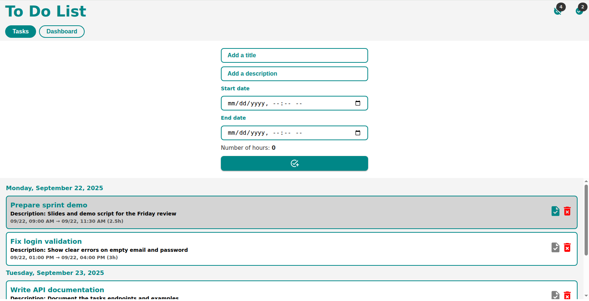
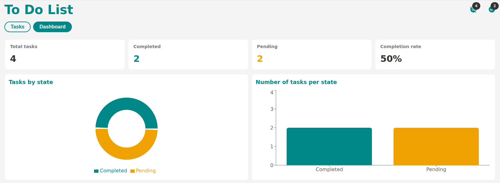

# My To Do List

A small task manager built with React and Vite. Tasks are saved in the browser's local storage, so the list survives a page reload without any backend.

## Features

- Create a task with a title, a description, a start date and an end date
- The number of hours is calculated from the start and end date
- Tasks are grouped in sections by date
- Mark a task as done or undo it, and delete it
- A dashboard with the state of the tasks: totals, completion rate, and two charts

## Tasks

Everything happens on one screen: the form on top, the list underneath, split by day.



## Dashboard

The dashboard summarizes the tasks and shows how many are done and how many are still pending.



## Demo


## Run it locally

```bash
npm install
npm run dev
```

## Other commands

```bash
npm run build     # production build
npm run preview   # serve the production build
npm run lint      # eslint
```
